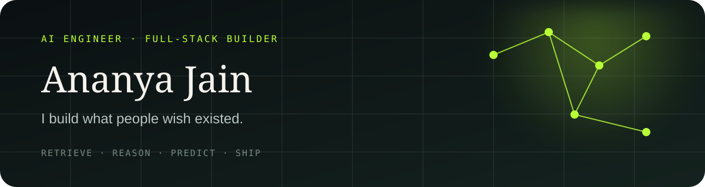

 

## Hello, I'm Ananya

I'm primarily an **AI engineer**, building systems that retrieve, reason, predict, and turn complex data into useful decisions. I'm also a **full-stack software engineer** who carries those ideas from models and APIs to reliable interfaces people can actually use.

Before choosing a model or framework, I focus on the **why behind the problem**—who experiences it, what is getting in their way, and what would make the solution genuinely useful.

> **I care about the path from an interesting model to a dependable product.**

<table>
<tr>
<td width="33%" valign="top">

### Intelligence

Machine learning, deep learning, computer vision, retrieval-augmented generation, and evaluation.

</td>
<td width="33%" valign="top">

### Engineering

Backend systems, APIs, databases, responsive interfaces, and reliable deployment.

</td>
<td width="33%" valign="top">

### Product thinking

Understanding the real problem first, then building only what makes the solution useful.

</td>
</tr>
</table>

## Technical arsenal

**Languages & product**

**Backend & systems**

**AI & machine learning**

## Experience

### AI Intern · Infosys Springboard
`Jun 2026 — Aug 2026 · Remote`

- Led a team building a full-stack AI-proctored examination platform for student, examiner, and admin workflows.
- Implemented client-side face detection with MediaPipe, automated grading designed for future LLM replacement, live monitoring, and attempt analytics.

### Open Source Contributor · GirlScript Summer of Code '25
`Aug 2025 — Oct 2025`

- Contributed **20+ pull requests** across five Python projects and improved work through review feedback.
- Ranked among the **top 2% of 30,000+ contributors** nationwide.

## Proof of consistency

<table>
<tr>
<td align="center" width="25%"><strong>550+</strong> LeetCode problems</td>
<td align="center" width="25%"><strong>365 days</strong> LeetCode badge</td>
<td align="center" width="25%"><strong>Top 2%</strong> GSSoC '25</td>
<td align="center" width="25%"><strong>AIR 825</strong> NCAT</td>
</tr>
</table>

### Build with purpose. Learn in public. Ship the complete system.

Open to AI engineering, machine learning, full-stack, and open-source opportunities.

