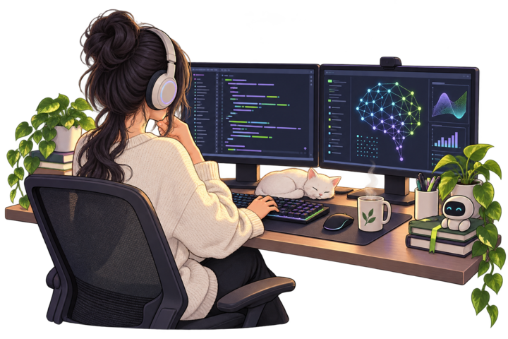

 

## Hello everyone , I'm Ananya Jain

<table>
<tr>
<td width="60%" valign="middle">

I'm primarily an **AI engineer**, building systems that retrieve, reason, predict, and turn complex data into useful decisions. I'm also a **full-stack software engineer** who carries those ideas from models and APIs to reliable interfaces people can actually use.

Before choosing a model or framework, I focus on the **why behind the problem**—who experiences it, what is getting in their way, and what would make the solution genuinely useful.

> **I care about the path from an interesting model to a dependable product.**

</td>
<td width="40%" align="center" valign="middle">

</td>
</tr>
</table>

<table>
<tr>
<td width="33%" valign="top">

### Intelligence

Machine learning, deep learning, computer vision, retrieval-augmented generation, and evaluation.

</td>
<td width="33%" valign="top">

### Engineering

Backend systems, APIs, databases, responsive interfaces, and reliable deployment.

</td>
<td width="33%" valign="top">

### Product thinking

Understanding the real problem first, then building only what makes the solution useful.

</td>
</tr>
</table>

## Technical arsenal

**Languages & product**

**Backend & systems**

**AI & machine learning**

## Featured projects

> **Five problems, five working systems—each built from the reason it needed to exist.**

### [FlowRAG — visual RAG pipeline builder](https://github.com/ananya-ctrl/FlowRAG)

- **Situation:** Designing a dependable RAG pipeline meant repeatedly testing disconnected choices for chunking, embeddings, retrieval, reranking, quality, and cost.
- **Task:** Create one workspace where developers could build, compare, evaluate, and export complete retrieval pipelines.
- **Action:** Built a Next.js and FastAPI platform with a drag-and-drop pipeline editor, AI configuration suggestions, multiple retrieval strategies, pgvector storage, live RAGAS-style evaluation, cost estimation, and Python code export.
- **Result:** Delivered an end-to-end environment that makes RAG experiments visible, comparable, and reusable instead of leaving decisions scattered across notebooks and scripts.

### [NeuralFlow — guided machine-learning workspace](https://github.com/ananya-ctrl/NeuralFlow)

- **Situation:** Training a useful ML model often requires repetitive setup and enough technical knowledge to choose algorithms, evaluate results, and interpret metrics.
- **Task:** Make structured machine-learning experimentation approachable without hiding the reasoning behind the output.
- **Action:** Built a guided workflow for uploading datasets, selecting algorithms, training models, and reviewing evaluation metrics, visualizations, and plain-language explanations.
- **Result:** Created a single workspace that takes an experiment from raw dataset to an understandable trained model, making iteration faster and more accessible.

### [ExamFlow — AI-proctored examination platform](https://github.com/ananya-ctrl/realtime-exam-platform)

- **Situation:** Online examinations need more than question delivery: institutions must coordinate candidates, examiners, administrators, integrity checks, grading, and live oversight.
- **Task:** Lead the development of a unified, role-based platform that could support the complete examination lifecycle.
- **Action:** Engineered student, examiner, and admin workflows; added browser-side MediaPipe face and gaze detection, fullscreen controls, live violation monitoring, analytics, multilingual support, and heuristic grading designed for later LLM replacement.
- **Result:** Delivered a full-stack, installable examination system that brings exam delivery, proctoring, evaluation, and administrative monitoring into one product.

### [Student Compass — student wellbeing companion](https://github.com/ananya-ctrl/Studentcompass)

- **Situation:** Students often track their mood, habits, reflections, and wellbeing across disconnected tools—or stop tracking them altogether.
- **Task:** Design a calmer, private space that could help students understand daily patterns and keep making progress.
- **Action:** Built a unified experience for mood check-ins, habit building, private journaling, and guided reflection, with an interface designed around everyday student life.
- **Result:** Turned several fragmented wellbeing routines into one coherent workspace that supports reflection without adding more friction.

### [PlantDoc — AI-assisted plant health screening](https://github.com/ananya-ctrl/plantdoc)

- **Situation:** Recognizing plant disease from visible symptoms can be difficult for users without immediate access to specialist guidance.
- **Task:** Build a simple path from a plant image to an actionable first assessment.
- **Action:** Developed an image-upload workflow backed by computer-vision classification, then connected predictions to disease information and treatment recommendations in a focused dashboard.
- **Result:** Created an accessible screening experience that converts a leaf image into a clear, useful next step for plant care.

## Experience

### AI Intern · Infosys Springboard
`Jun 2026 — Aug 2026 · Remote`

- Led a team building a full-stack AI-proctored examination platform for student, examiner, and admin workflows.
- Implemented client-side face detection with MediaPipe, automated grading designed for future LLM replacement, live monitoring, and attempt analytics.

### Open Source Contributor · GirlScript Summer of Code '25
`Aug 2025 — Oct 2025`

- Contributed **20+ pull requests** across five Python projects and improved work through review feedback.
- Ranked among the **top 2% of 30,000+ contributors** nationwide.

## Proof of consistency

<table>
<tr>
<td align="center" width="25%"><strong>550+</strong> LeetCode problems</td>
<td align="center" width="25%"><strong>365 days</strong> LeetCode badge</td>
<td align="center" width="25%"><strong>Top 2%</strong> GSSoC '25</td>
<td align="center" width="25%"><strong>AIR 825</strong> NCAT</td>
</tr>
</table>

### Build with purpose. Learn in public. Ship the complete system.

Open to AI engineering, machine learning, full-stack, and open-source opportunities.

